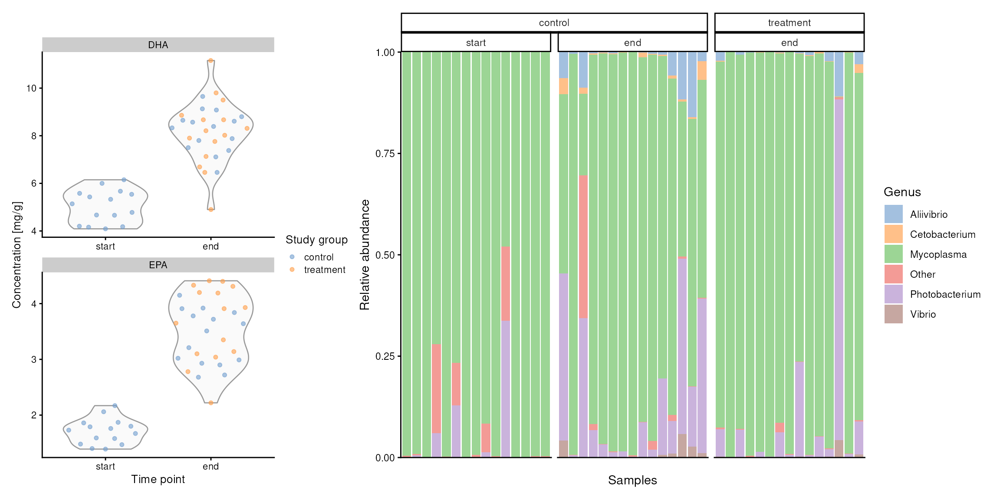

# HoloFoodR: a statistical programming framework for holo-omics data integration workflows

## Introduction

[HoloFood database](https://www.holofooddata.org) is a large collection
of holo-omic and multi-omic data from two animal systems, chicken and
salmon. It was created by the HoloFood consortium. One of its objectives
is to study the interactions between animal systems, their microbiomes,
and feed additives to optimize the diet strategies of these farm
animals.

For make it easily accessible, the developers provide an Application
Programming Interface (API) that permits interaction with programming
languages, such as R or Python.

We improve the accessibility by creating the HoloFoodR package that
simplifies API interaction and assists translating raw database data
into R/Bioconductor data containers, connecting to a vast ecosystem of
bioinformatics R packages.

We do not aim to demonstrate HoloFoodR in isolation from the rest of the
ecosystem, but to showcase the possibility of data integration from
other databases, such as MGnify, which holds metagenomic data.
Furthermore, we provide a workflow from data exploration to advanced
machine learning and multi-omics, offering a practical example for
readers.

Our main study questions are:

- How does treatment influence the gut microbiota of salmon?
- Do gut flora and fatty acids composition evolve over time?
- Is there a relationship between gut microbiota and the fatty acid
  composition in muscle tissue?

``` r

# List of packages that we need
packages <- c(
    "dplyr", "DT", "ggsignif", "HoloFoodR", "MGnifyR", "mia", "miaViz", "MOFA2",
    "patchwork", "reticulate", "scater", "shadowtext"
)

# Load all packages into session. Stop if there are packages that were not
# successfully loaded
pkgs_not_loaded <- !sapply(packages, function(pkg){
    suppressPackageStartupMessages(require(pkg, character.only = TRUE))
})
pkgs_not_loaded <- names(pkgs_not_loaded)[pkgs_not_loaded]
if (length(pkgs_not_loaded) > 0) {
    stop("Error in loading the following packages into the session: '",
        paste0(pkgs_not_loaded, collapse = "', '"), "'")
}
```

## Import data

We start the workflow from data retrieval. We will use [salmon
data](https://www.holofooddata.org/samples/?animal__system=salmon) and
its associated fatty acid and metagenomic amplicon as an example.

### Retrieve HoloFood data

First of all, we have to query the HoloFood database to retrieve the
salmon accession numbers.

``` r

# Get salmon samples
salmons <- HoloFoodR::doQuery("animals", system = "salmon", use.cache = TRUE)

# Get only the data that has both metagenomic amplicon and fatty acid
# data
salmons <- salmons |>
    filter(fatty_acids == TRUE & metagenomic_amplicon == TRUE)

colnames(salmons)
```

Next, we can retrieve the data associated with each salmon.

``` r

# Get salmon data
salmon_data <- HoloFoodR::getData(
    accession.type = "animals",
    accession = salmons[["accession"]],
    use.cache = TRUE
)

# Get salmon samples
salmon_samples <- salmon_data[["samples"]]

# Get sample IDs
salmon_sample_ids <- unique(salmon_samples[["accession"]])

head(salmon_sample_ids)
```

The data returned above is a list of all sample accession numbers that
are associated with all salmons. For example, metagenomic amplicon
samples, such as
[SAMEA112750580](https://www.holofooddata.org/sample/SAMEA112750580) or
fatty acid samples,
[SAMEA112950027](https://www.holofooddata.org/sample/SAMEA112950027).

We can use these accession numbers to fetch the data associated with
each sample type and store them as `experiments` in a
`MultiAssayExperiment` (`MAE`) object.

``` r

# Get salmon <- experiments as MAE object
mae <- HoloFoodR::getResult(
    salmon_sample_ids,
    use.cache = TRUE
)
```

### Fetch metagenomic data from MGnify

HoloFood database does not include the data for metagenomic data. This
data can be retrieved from the [MGnify
portal](https://www.ebi.ac.uk/metagenomics). For this purpose, we will
use [MGnifyR
package](https://bioconductor.org/packages/release/bioc/html/MGnifyR.html),
which in a similar fashion to HoloFoodR, allows simple interaction with
MGnify API.

``` r

# Create MGnify object
mg <- MgnifyClient(
    useCache = TRUE,
    cacheDir = ".MGnifyR_cache"
)

# Select only metagenomic_amplicon sample type
metagenomic_salmon_samples <- salmon_samples |>
    filter(sample_type == "metagenomic_amplicon")

# Search for sample IDs in MGnify database
salmon_analysis_ids <- searchAnalysis(
    mg,
    type = "samples",
    metagenomic_salmon_samples[["accession"]]
)
```

`salmon_analysis_ids` character vector holds associations of HoloFood
metagenomic amplicon accession numbers (SAMEAxxxxxx) to their
counterparts in MGnify database (MGYAxxxxxx).

``` r

# Get metagenomic taxonomic data for salmon from MGnify
tse <- MGnifyR::getResult(
    mg,
    accession = salmon_analysis_ids,
    get.func = FALSE
)
```

Data fetched from MGnify has MGnify-specific identifiers. We have to
first rename samples with HoloFood specific ID and then add the data to
`MultiAssayExperiment` combining all the data.

``` r

# Add MGnify results to HoloFood data
mae <- addMGnify(tse, mae)
#> Warning: 'experiments' dropped; see 'drops()'
#> harmonizing input:
#>   removing 189 sampleMap rows not in names(experiments)
#> harmonizing input:
#>   removing 189 sampleMap rows not in names(experiments)
```

Now we have retrieved all the data that we are interested in this
workflow.

## Data preprocess

Data cleaning is one of the most time-consuming and most important steps
in data analysis. For instance, we need to handle missing data,
transform data assays, and agglomerate the data.

In the next steps, we will:

1.  Filter data
2.  Ensure that the data is in correct format for analysis
3.  Agglomerate data
4.  Transform data

### Wrangle the data

Below we see upset plot that summarizes the available experiments and
how samples overlap between them.

``` r

upset_plot <- upsetSamples(mae)
#> Warning: `aes_string()` was deprecated in ggplot2 3.0.0.
#> ℹ Please use tidy evaluation idioms with `aes()`.
#> ℹ See also `vignette("ggplot2-in-packages")` for more information.
#> ℹ The deprecated feature was likely used in the UpSetR package.
#>   Please report the issue to the authors.
#> This warning is displayed once per session.
#> Call `lifecycle::last_lifecycle_warnings()` to see where this warning was
#> generated.
#> Warning: Using `size` aesthetic for lines was deprecated in ggplot2 3.4.0.
#> ℹ Please use `linewidth` instead.
#> ℹ The deprecated feature was likely used in the UpSetR package.
#>   Please report the issue to the authors.
#> This warning is displayed once per session.
#> Call `lifecycle::last_lifecycle_warnings()` to see where this warning was
#> generated.
#> Warning: The `size` argument of `element_line()` is deprecated as of ggplot2 3.4.0.
#> ℹ Please use the `linewidth` argument instead.
#> ℹ The deprecated feature was likely used in the UpSetR package.
#>   Please report the issue to the authors.
#> This warning is displayed once per session.
#> Call `lifecycle::last_lifecycle_warnings()` to see where this warning was
#> generated.
upset_plot
```


The distribution of experiments in the dataset, along with the number of
samples in each experiment.

For demonstration purposes, we will focus on investigating fatty acids
and metagenomic data within the trial A performed by the HoloFood
consortium. This trial the health effects of fermented seaweed added to
the diet of salmons. The following script subsets the data to include
aforementioned data.

``` r

# Harmonize experiment names
names(mae) <- names(mae) |>
    tolower() |>
    gsub(pattern = " ", replacement = "_")

# Fetch only experiments that we need
mae <- mae[, , c("fatty_acids_mg", "metagenomic")]
#> Warning: 'experiments' dropped; see 'drops()'
#> harmonizing input:
#>   removing 934 sampleMap rows not in names(experiments)
names(mae) <- c("fatty_acids", "metagenomic")
# Filter MAE object to include only Trial A
mae <- mae[, colData(mae)[["Trial code"]] == "SA", ]
```

Some values of fatty acids are under detection thresholds. We assume
them to be zeroes. Moreover, the data includes a feature that just
states from where the fatty acids were collected. We remove this feature
to ensure that the assay contains only numeric values.

``` r

# From metabolomic data, remove organ-fatty acids row because it only contains a
# string value "muscle" which denotes where the sample was drawn from
tse <- mae[[1]]
tse <- tse[!(rowData(tse)[["marker.name"]] %in% c("Organ-fatty acids")), ]
mae[[1]] <- tse

# Transform matrix to numeric. Some values are "< 0.01"
# If a number is < 0.01, assume it to be 0
assay <- assay(mae[[1]], "counts")
assay[assay == "<0.01"] <- 0
assay <- apply(assay, c(1, 2), function(x) as.numeric(gsub(",", ".", x)))

# Reassign assay back to MAE
assay(mae[[1]], "counts") <- assay
```

Moreover, we wrangle the sample metadata so that it includes all
necessary information.

``` r

# Add time points
timepoints <- colData(mae[[2]])
timepoints <- timepoints[
    match(timepoints[["animal"]], rownames(colData(mae))), ]
timepoints <- ifelse(timepoints[["trial.timepoint"]] == 0, "start", "end")
timepoints <- factor(timepoints, levels = c("start", "end"))
colData(mae)[["timepoint"]] <- timepoints

# Add treatment groups
colData(mae)[["study_group"]] <- ifelse(
    colData(mae)[["Treatment concentration"]]>0, "treatment", "control")
colData(mae)[colData(mae)[["timepoint"]] == "start" , "study_group"] <-
    "control"

# Add animal metadata to separate experiments
mae[[1]] <- getWithColData(mae, 1)
#> Warning: Ignoring redundant column names in 'colData(x)': canonical_url,
#> marker.type
mae[[2]] <- getWithColData(mae, 2)
#> Warning: Ignoring redundant column names in 'colData(x)': canonical_url,
#> marker.type
```

### Filtering and agglomeration

Next, we can agglomerate features by prevalence to reduce the number of
low-abundant taxa and contaminants.

First, we visualize prevalence distribution of taxa with a histogram to
decide the prevalence threshold to use. We use 0.2% detection level to
filter out extremely low-abundant genera.

``` r

# Add relative abundance data
mae[[2]] <- transformAssay(mae[[2]], method = "relabundance")

# Compute prevalence of relative abundance of microbial genera at detection
# level of 0.1%
prevalence <- getPrevalence(
    mae[[2]],
    rank = "Genus",
    assay.type = "relabundance",
    na.rm = TRUE,
    sort = TRUE,
    detection = 0.2 / 100
)

# Exclude microbes with 0 prevalence
prevalence <- prevalence[prevalence != 0]

hist(prevalence, main = "", xlab = "Prevalence")
```


The prevalence of microbial genera across samples.

We can also look at the raw prevalence numbers.

``` r

# Sort prevalence in decreasing order
sort(prevalence, decreasing = TRUE) |> head(10)
#>     Mycoplasma Photobacterium     Aliivibrio  Cetobacterium         Vibrio 
#>      0.9777778      0.7111111      0.4000000      0.2666667      0.2444444 
#> Ammopiptanthus    Francisella    Paucibacter  Mycobacterium       Medicago 
#>      0.1555556      0.1333333      0.1111111      0.1111111      0.1111111
```

*Mycoplasma* is present in all samples, which is not surprising as this
genus was found to be one of the most common in salmon intestine (see
Zarkasi et al. (2014)).

We then agglomerate our data by prevalence and by taxonomic rank to
obtain group all genera which are below the specified thresholds to the
“Other” group. This step is necessary to ensure that we only work with
the most relevant taxa, while not excluding the rest of data points. We
use thresholds 20% and 0.2% for prevalence and detection, respectively.

``` r

# Agglomerate by prevalence by genus
altExp(mae[[2]], "prev_genus") <- agglomerateByPrevalence(
    mae[[2]],
    assay.type = "relabundance",
    rank = "Genus",
    prevalence = 20 / 100,
    detection = 0.2 / 100
)
```

Due to the limited number of samples, we also filter the fatty acid data
to include only those fatty acids that show variation within the
dataset. The rationale is that if a fatty acid does not vary, it cannot
exhibit differences between groups. We can find out a good threshold for
the cutoff with a histogram of standard deviations of fatty acid
abundances.

``` r

rowData(mae[[1]])[["sd"]] <- rowSds(assay(mae[[1]], "counts"), na.rm = TRUE)
hist(rowData(mae[[1]])[["sd"]], breaks = 30, main = "",
    xlab = "Standard deviation")

# Increase the number of x axis ticks
x_labels <- seq(from = min(assay(mae[[1]])), to = max(assay(mae[[1]])), by = 1)
axis(side = 1, at = x_labels, labels = x_labels)
```


The distribution of standard deviations of fatty acid abundances.

- Percentage of fatty acids with a standard deviation (SD) below 0.5:
  61.7%
- Percentage of fatty acids with a standard deviation (SD) below 1:
  73.3%

We apply a filtering threshold of 0.5 to exclude fatty acids that do not
exhibit sufficient variation in the dataset. Since most standard
deviations are below 1, it is a reasonable number if we do not want to
exclude too many fatty acids.

``` r

mae[[1]] <- mae[[1]][ rowData(mae[[1]])[["sd"]] > 0.5, ]
```

For more detailed analysis, we pick certain fatty acids that have
well-established biological relevance. These include:

- Docosahexaenoic acid (DHA)
- Eicosapentaenoic acid (EPA)
- Alpha-linolenic acid
- Arachidonic acid
- Linoleic acid
- Oleic acid
- Palmitic acid
- Stearic acid

``` r

relevant_fatty_acids <- c(
    "Docosahexaenoic acid 22:6n-3 (DHA)",
    "Eicosapentaenoic acid 20:5n-3 (EPA)",
    "Alpha-Linolenic acid 18:3n-3",
    "Arachidonic acid 20:4n-6 (ARA)",
    "Linoleic acid 18:2n-6",
    "Oleic acid 18:1n-9",
    "Palmitic acid 16:0",
    "Stearic acid 18:0"
)
altExp(mae[[1]], "relevant") <- mae[[1]][
    rownames(mae[[1]]) %in% relevant_fatty_acids, ]
```

### Transformation

We transform metagenomic counts with relative transformation and
centered log-ratio method to tackle the compositional data (see Quinn et
al. (2019)).

``` r

# Transform microbiome with centered log-ratio method
mae[[2]] <- transformAssay(
    mae[[2]],
    assay.type = "counts",
    method = "relabundance",
    MARGIN = "cols",
    altexp = altExpNames(mae[[2]])
)
mae[[2]] <- transformAssay(
    mae[[2]],
    assay.type = "counts",
    method = "clr",
    pseudocount = TRUE,
    MARGIN = "cols",
    altexp = altExpNames(mae[[2]])
)
#> A pseudocount of 0.5 was applied.
#> A pseudocount of 0.5 was applied.
```

Fatty acid data is already compositional as it is measured as
concentration (mg/g). We apply a log10 transformation to address
skewness in the data. Finally, the data is standardized to ensure all
features are on a comparable scale.

``` r

mae[[1]] <- transformAssay(
    mae[[1]],
    assay.type = "counts",
    method = "log10",
    MARGIN = "cols"
)
mae[[1]] <- transformAssay(
    mae[[1]],
    assay.type = "log10",
    method = "standardize",
    MARGIN = "rows"
)
```

## Analyzing fatty acids: Time and treatment effects

We aim to investigate how fatty acids evolve over time and, more
importantly, whether the feed additive impacts these fatty acids. To
achieve this, we will fit a simple linear model for each fatty acid,
accounting for time and treatment effects in a non-parametric manner.
These models resemble the Wilcoxon test but include additional
covariates. This approach will allow us to estimate the variability
explained by time, treatment, or both factors.

``` r

# Get fatty acids that we are going to test
tse <- altExp(mae[[1]], "relevant")

# For each fatty acid, fit linear model
res <- lapply(rownames(tse), function(feat){
    # Get data of single feature
    df <- meltSE(tse[feat, ], add.col = TRUE)
    # Fit model
    res <- lm(rank(counts) ~ study_group + timepoint, data = df)
    # Get only p-values
    res <- summary(res)
    res <- res[[4]][, 4]
    return(res)
})
# Combine results and adjust p-values
res <- do.call(rbind, res) |> as.data.frame()
res <- lapply(res, p.adjust, method = "fdr") |> as.data.frame()
# Add feature names
res[["feature"]] <- rownames(tse)
res |> datatable()
```

As observed, treatment does not appear to affect fatty acid
concentrations significantly. In contrast, time seems to influence
nearly all fatty acids; as salmon grow, certain fatty acid
concentrations in their muscle tissue increase. This relationship can be
further visualized as follows.

``` r

p <- plotExpression(
    tse, rownames(tse), assay.type = "counts", x = "timepoint",
    colour_by = "study_group", scales = "free")
p
```


Concentrations of selected fatty acids at the start and end of the
trial, with an indication of whether animals received treatment.

## Analyzing microbiota: Time and treatment effects

### Microbial composition

As a first step in analysing microbiota data, we summarize the microbial
composition with relative abundance barplot.

``` r

p <- plotAbundance(
    altExp(mae[[2]], "prev_genus"),
    assay.type = "relabundance",
    col.var = c("study_group", "timepoint"),
    facet.cols = TRUE, scales = "free_x"
    ) +
  guides(fill = guide_legend(title = "Genus"))
p
#> Warning: Removed 44 rows containing missing values or values outside the scale range
#> (`geom_bar()`).
```


Relative abundance of core microbial genera across samples.

Salmon gut seems to be dominated by either genus *Mycoplasma* or
*Photobacterium*.

### Association of alpha diversity with treatment and salmon age

Now, let’s proceed to calculate the Shannon alpha diversity index.

``` r

# Calculate alpha diversity
mae[[2]] <- addAlpha(mae[[2]])
#> Warning: 'faith' index can be calculated only for TreeSE with rowTree(x)
#> populated or with 'tree' provided separately.
```

With the alpha diversity indices calculated and added to `colData`, we
can now assess whether time and treatment influence the microbial
diversity in the salmon gut flora.

``` r

# Get sample metadata
df <- colData(mae[[2]])
# Fit model to estimate influence of treatment and time to diversity
res <- lm(rank(shannon_diversity) ~ study_group + timepoint, data = df)
res <- summary(res)
res
#> 
#> Call:
#> lm(formula = rank(shannon_diversity) ~ study_group + timepoint, 
#>     data = df)
#> 
#> Residuals:
#>     Min      1Q  Median      3Q     Max 
#> -20.933 -10.267  -3.267   9.067  27.200 
#> 
#> Coefficients:
#>                      Estimate Std. Error t value Pr(>|t|)    
#> (Intercept)            16.800      3.138   5.353 3.36e-06 ***
#> study_grouptreatment   -8.333      4.438  -1.878  0.06738 .  
#> timepointend           13.467      4.438   3.034  0.00412 ** 
#> ---
#> Signif. codes:  0 '***' 0.001 '**' 0.01 '*' 0.05 '.' 0.1 ' ' 1
#> 
#> Residual standard error: 12.15 on 42 degrees of freedom
#> Multiple R-squared:  0.1826, Adjusted R-squared:  0.1436 
#> F-statistic:  4.69 on 2 and 42 DF,  p-value: 0.0145
```

Based on the results, we conclude that older salmon exhibit distinct
microbial diversity compared to younger ones. Additionally, there
appears to be a slight — though not statistically significant — effect
of treatment on microbial diversity.

``` r

p <- plotColData(
    mae[[2]], x = "timepoint", y = "shannon_diversity",
    colour_by = "study_group")
p
```


Shannon diversity of microbial communities in salmon at the start and
end of the trial, with information on treatment status.

### Microbial dissimilarity among samples

Let’s analyze whether we can find similar effect with beta diversity.
Here we perform Principal Coordinate Analysis (PCoA) with Bray-Curtis
dissimilarity.

``` r

# Run PCoA
mae[[2]] <- runMDS(
    mae[[2]],
    FUN = getDissimilarity,
    method = "bray",
    assay.type = "relabundance"
)

# Display dissimilarity on a plot
p <- plotReducedDim(mae[[2]], "MDS", colour_by = "timepoint")
p
```


PCoA (Bray-Curtis) of microbial data.

Distinct patterns in the PCoA plot show samples clustering by time
points, indicating that microbial profiles vary with salmon age. This
reinforces the results observed in alpha diversity, supporting an
association between age and shifts in microbial diversity.

## Multi-omics integration

Multi-omic factor analysis (MOFA) (see Argelaguet et al. (2020)) allows
us to discover latent factors that underlie the biological differences
by taking in consideration 2 or more omic assays. To cite the original
authors, “MOFA can be viewed as a statistically rigorous generalization
of (sparse) principal component analysis (PCA) to multi-omics data”.

By applying MOFA analysis, our goal is to determine whether metagenomics
and fatty acids exhibit shared variability, ultimately assessing whether
the microbial community is associated with fatty acid composition.

``` r

mae_temp <- mae
mae_temp[[2]] <- altExp(mae_temp[[2]], "prev_genus")

# Extract only transformed metagenomic assays for MOFA analysis
assays(mae_temp[[1]]) <- assays(mae_temp[[1]])[
    names(assays(mae_temp[[1]])) %in% c("standardize")
]
assays(mae_temp[[2]]) <- assays(mae_temp[[2]])[
    names(assays(mae_temp[[2]])) %in% c("counts")
]

# Transform MAE object to MOFA model
model <- create_mofa_from_MultiAssayExperiment(mae_temp)

# Set model's options
model_opts <- get_default_model_options(model)
model_opts$num_factors <- 5
model_opts$likelihoods[[2]] <- "poisson"
train_opts <- get_default_training_options(model)
train_opts$maxiter <- 20000

# Change convergence mode to slightly improve accuracy
train_opts$convergence_mode <- "slow"

# Prepare MOFA model
model <- prepare_mofa(
    object = model,
    model_options = model_opts,
    training_options = train_opts
)
#> Warning in prepare_mofa(object = model, model_options = model_opts,
#> training_options = train_opts): Some view(s) have less than 15 features, MOFA
#> will have little power to to learn meaningful factors for these view(s)....
#> Checking data options...
#> No data options specified, using default...
#> Checking training options...
#> Checking model options...

# Train model
model <- run_mofa(model, use_basilisk = TRUE)
#> Warning in run_mofa(model, use_basilisk = TRUE): No output filename provided. Using /tmp/RtmpnACnUH/mofa_20260210-094313.hdf5 to store the trained model.
#> Connecting to the mofapy2 package using basilisk. 
#>     Set 'use_basilisk' to FALSE if you prefer to manually set the python binary using 'reticulate'.
#> + /github/home/.pyenv/versions/3.12.12/bin/python3.12 -m venv /github/home/.cache/R/basilisk/1.23.0/MOFA2/1.21.3/mofa_env
#> + /github/home/.cache/R/basilisk/1.23.0/MOFA2/1.21.3/mofa_env/bin/python -m pip install --upgrade pip wheel setuptools
#> + /github/home/.cache/R/basilisk/1.23.0/MOFA2/1.21.3/mofa_env/bin/python -m pip install --upgrade --no-user 'numpy==1.26.4' 'scipy==1.12.0' 'pandas==2.2.1' 'h5py==3.10.0' 'scikit-learn==1.4.0' 'dtw-python==1.3.1' 'mofapy2==0.7.3'
```

Next, we will plot the variances explained by each factor.

``` r

# Plot explained variances
p <- plot_variance_explained(model)
# Get explained variances from model as numeric values
df <- model@cache[[1]][[2]][[1]] |> stack()
df[["percentage"]] <- paste0(round(df[["value"]]), "%")
# Add them to plot
p <- p + geom_shadowtext(aes(label = df[["percentage"]]))
p
```


Explained variance by the model for microbial and fatty acid data.

Factor 1 captures only variance within the metagenomics data, while over
2/3 of variance captured by Factor 2 represents variance in fatty acids.
Factor 3 captures shared variability between the metagenomic data and
fatty acids, reflecting interconnected patterns between the two
datasets.

Before exploring the shared variability, we first examine which
metagenomic variability is captured by Factor 1. We do not plot fatty
acid weights because the captured variability in factor 1 for fatty
acids is 0% as seen in the previous plot.

``` r

p2 <- plot_top_weights(model, view = 2, factors = 1, nfeatures = 25) +
    labs(title = "Microbiota")

p2
```


Features with the highest loadings for Factor 1.

From the plot above, we can see that the first factor captures mostly
the variability in *Mycoplasma*.

Let us then focus on loadings of factor 2.

``` r

p1 <- plot_top_weights(model, view = 1, factors = 2, nfeatures = 25) +
    labs(title = "Fatty acids")
p2 <- plot_top_weights(model, view = 2, factors = 2, nfeatures = 25) +
    labs(title = "Microbiota")

p1 + p2
```


Features with the highest loadings for Factor 2.

In the microbial data, particularly *Cetobacterium*, *Vibrio*, and
*Aliivibrio* show a negative association with Factor 2. Additionally,
many fatty acids display significant negative weights in this factor,
though no single fatty acid can be specifically tied to these taxa. This
suggests that as the abundances of these taxa is rise (or decrease),
there is a corresponding increase (or decrease) in overall fatty acid
levels.

Next, we visualize Factor 3 that captured variance more evenly between
microbes and fatty acids.

``` r

p1 <- plot_top_weights(model, view = 1, factors = 3, nfeatures = 25) +
    labs(title = "Fatty acids")
p2 <- plot_top_weights(model, view = 2, factors = 3, nfeatures = 25) +
    labs(title = "Microbiota")

p1 + p2
```


Features with the highest loadings for Factors 3.

From the shared Factor 3, *Photobacterium* emerge prominently. Similarly
to Factor 2, no single fatty acid can be directly associated with any of
the microbial species, including *Photobacterium*.

Worth noting is that, out of these 5 taxa, only *Mycoplasma* does not
appear to share any variability with fatty acids as all its variability
was captured by the first factor which did not associate with fatty
acids.

## Conclusions

The present case study has demonstrated how easy and fast it is to
download large dataset and transform the data into a
`MultiAssayExperiment`, which in turn gives the researchers access to an
extensive plethora of downstream tools, such `mia` and `MOFA2` that can
be used to pre-process and visualize the multi-omics data.

## Appendix

``` r

features <- c(
    "Docosahexaenoic acid 22:6n-3 (DHA)", "Eicosapentaenoic acid 20:5n-3 (EPA)")
tse <- mae[[1]]
tse <- tse[features, ]
rownames(tse) <- c("DHA", "EPA")
p1 <- plotExpression(
    tse, rownames(tse), assay.type = "counts", x = "timepoint",
    colour_by = "study_group", scales = "free", ncol = 1) +
    labs(x = "Time point", y = "Concentration [mg/g]") +
    guides(colour = guide_legend(title = "Study group"))

p2 <- plotAbundance(
    altExp(mae[[2]], "prev_genus"),
    assay.type = "relabundance",
    col.var = c("study_group", "timepoint"),
    facet.cols = TRUE, scales = "free_x"
    ) +
    labs(y = "Relative abundance") +
  guides(fill = guide_legend(title = "Genus"))

p1 + p2  + plot_layout(widths = c(1, 2))
#> Warning: Removed 44 rows containing missing values or values outside the scale range
#> (`geom_bar()`).
```



``` r

sessionInfo()
#> R Under development (unstable) (2026-02-08 r89382)
#> Platform: x86_64-pc-linux-gnu
#> Running under: Ubuntu 24.04.3 LTS
#> 
#> Matrix products: default
#> BLAS:   /usr/lib/x86_64-linux-gnu/openblas-pthread/libblas.so.3 
#> LAPACK: /usr/lib/x86_64-linux-gnu/openblas-pthread/libopenblasp-r0.3.26.so;  LAPACK version 3.12.0
#> 
#> locale:
#>  [1] LC_CTYPE=en_US.UTF-8       LC_NUMERIC=C              
#>  [3] LC_TIME=en_US.UTF-8        LC_COLLATE=en_US.UTF-8    
#>  [5] LC_MONETARY=en_US.UTF-8    LC_MESSAGES=en_US.UTF-8   
#>  [7] LC_PAPER=en_US.UTF-8       LC_NAME=C                 
#>  [9] LC_ADDRESS=C               LC_TELEPHONE=C            
#> [11] LC_MEASUREMENT=en_US.UTF-8 LC_IDENTIFICATION=C       
#> 
#> time zone: UTC
#> tzcode source: system (glibc)
#> 
#> attached base packages:
#> [1] stats4    stats     graphics  grDevices utils     datasets  methods  
#> [8] base     
#> 
#> other attached packages:
#>  [1] shadowtext_0.1.6                scater_1.39.2                  
#>  [3] scuttle_1.21.0                  reticulate_1.44.1              
#>  [5] patchwork_1.3.2                 MOFA2_1.21.3                   
#>  [7] miaViz_1.19.1                   ggraph_2.2.2                   
#>  [9] ggplot2_4.0.2                   mia_1.19.2                     
#> [11] MGnifyR_1.7.1                   HoloFoodR_1.3.1                
#> [13] TreeSummarizedExperiment_2.19.0 Biostrings_2.79.4              
#> [15] XVector_0.51.0                  SingleCellExperiment_1.33.0    
#> [17] MultiAssayExperiment_1.37.2     SummarizedExperiment_1.41.1    
#> [19] Biobase_2.71.0                  GenomicRanges_1.63.1           
#> [21] Seqinfo_1.1.0                   IRanges_2.45.0                 
#> [23] S4Vectors_0.49.0                BiocGenerics_0.57.0            
#> [25] generics_0.1.4                  MatrixGenerics_1.23.0          
#> [27] matrixStats_1.5.0               ggsignif_0.6.4                 
#> [29] DT_0.34.0                       dplyr_1.2.0                    
#> [31] knitr_1.51                      BiocStyle_2.39.0               
#> 
#> loaded via a namespace (and not attached):
#>   [1] splines_4.6.0               ggplotify_0.1.3            
#>   [3] urltools_1.7.3.1            filelock_1.0.3             
#>   [5] tibble_3.3.1                triebeard_0.4.1            
#>   [7] polyclip_1.10-7             DirichletMultinomial_1.53.0
#>   [9] lifecycle_1.0.5             httr2_1.2.2                
#>  [11] lattice_0.22-9              MASS_7.3-65                
#>  [13] crosstalk_1.2.2             SnowballC_0.7.1            
#>  [15] magrittr_2.0.4              sass_0.4.10                
#>  [17] rmarkdown_2.30              jquerylib_0.1.4            
#>  [19] yaml_2.3.12                 otel_0.2.0                 
#>  [21] cowplot_1.2.0               DBI_1.2.3                  
#>  [23] RColorBrewer_1.1-3          abind_1.4-8                
#>  [25] Rtsne_0.17                  purrr_1.2.1                
#>  [27] yulab.utils_0.2.4           tweenr_2.0.3               
#>  [29] rappdirs_0.3.4              gdtools_0.5.0              
#>  [31] ggrepel_0.9.6               irlba_2.3.7                
#>  [33] tokenizers_0.3.0            tidytree_0.4.7             
#>  [35] pheatmap_1.0.13             vegan_2.7-2                
#>  [37] pkgdown_2.2.0               permute_0.9-10             
#>  [39] DelayedMatrixStats_1.33.0   codetools_0.2-20           
#>  [41] DelayedArray_0.37.0         ggforce_0.5.0              
#>  [43] tidyselect_1.2.1            aplot_0.2.9                
#>  [45] farver_2.1.2                ScaledMatrix_1.19.0        
#>  [47] viridis_0.6.5               jsonlite_2.0.0             
#>  [49] BiocNeighbors_2.5.3         decontam_1.31.0            
#>  [51] tidygraph_1.3.1             systemfonts_1.3.1          
#>  [53] tools_4.6.0                 ggnewscale_0.5.2           
#>  [55] treeio_1.35.0               ragg_1.5.0                 
#>  [57] Rcpp_1.1.1                  glue_1.8.0                 
#>  [59] BiocBaseUtils_1.13.0        gridExtra_2.3              
#>  [61] SparseArray_1.11.10         xfun_0.56                  
#>  [63] mgcv_1.9-4                  HDF5Array_1.39.0           
#>  [65] withr_3.0.2                 BiocManager_1.30.27        
#>  [67] fastmap_1.2.0               ggh4x_0.3.1                
#>  [69] basilisk_1.23.0             rhdf5filters_1.23.3        
#>  [71] bluster_1.21.0              digest_0.6.39              
#>  [73] rsvd_1.0.5                  R6_2.6.1                   
#>  [75] gridGraphics_0.5-1          textshaping_1.0.4          
#>  [77] h5mread_1.3.1               ecodive_2.2.2              
#>  [79] UpSetR_1.4.0                tidyr_1.3.2                
#>  [81] fontLiberation_0.1.0        DECIPHER_3.7.0             
#>  [83] graphlayouts_1.2.2          httr_1.4.7                 
#>  [85] htmlwidgets_1.6.4           S4Arrays_1.11.1            
#>  [87] uwot_0.2.4                  pkgconfig_2.0.3            
#>  [89] gtable_0.3.6                S7_0.2.1                   
#>  [91] janeaustenr_1.0.0           htmltools_0.5.9            
#>  [93] fontBitstreamVera_0.1.1     bookdown_0.46              
#>  [95] scales_1.4.0                png_0.1-8                  
#>  [97] corrplot_0.95               ggfun_0.2.0                
#>  [99] reshape2_1.4.5              nlme_3.1-168               
#> [101] cachem_1.1.0                rhdf5_2.55.13              
#> [103] stringr_1.6.0               parallel_4.6.0             
#> [105] vipor_0.4.7                 desc_1.4.3                 
#> [107] pillar_1.11.1               grid_4.6.0                 
#> [109] vctrs_0.7.1                 BiocSingular_1.27.1        
#> [111] beachmat_2.27.2             cluster_2.1.8.2            
#> [113] beeswarm_0.4.0              evaluate_1.0.5             
#> [115] cli_3.6.5                   compiler_4.6.0             
#> [117] rlang_1.1.7                 crayon_1.5.3               
#> [119] tidytext_0.4.3              labeling_0.4.3             
#> [121] forcats_1.0.1               plyr_1.8.9                 
#> [123] fs_1.6.6                    ggbeeswarm_0.7.3           
#> [125] ggiraph_0.9.4               stringi_1.8.7              
#> [127] viridisLite_0.4.3           BiocParallel_1.45.0        
#> [129] lazyeval_0.2.2              fontquiver_0.2.1           
#> [131] Matrix_1.7-4                dir.expiry_1.19.0          
#> [133] sparseMatrixStats_1.23.0    Rhdf5lib_1.33.0            
#> [135] igraph_2.2.1                memoise_2.0.1              
#> [137] bslib_0.10.0                ggtree_4.1.1               
#> [139] ape_5.8-1
```

Argelaguet, Ricard, Damien Arnol, Danila Bredikhin, et al. 2020. “MOFA+:
A Statistical Framework for Comprehensive Integration of Multi-Modal
Single-Cell Data.” *Genome Biology* 21 (1).
<https://doi.org/10.1186/s13059-020-02015-1>.

Quinn, Thomas P., Ionas Erb, Greg Gloor, Cedric Notredame, Mark F.
Richardson, and Tamsyn M. Crowley. 2019. “A Field Guide for the
Compositional Analysis of Any-Omics Data.” *GigaScience* 8 (9): giz107.
<https://doi.org/10.1093/gigascience/giz107>.

Zarkasi, K. Z., G. C. J. Abell, R. S. Taylor, et al. 2014.
“Pyrosequencing-Based Characterization of Gastrointestinal Bacteria of
Atlantic Salmon (Salmo Salar L.) Within a Commercial Mariculture
System.” *Journal of Applied Microbiology* 117 (1): 18–27.
<https://doi.org/10.1111/jam.12514>.
